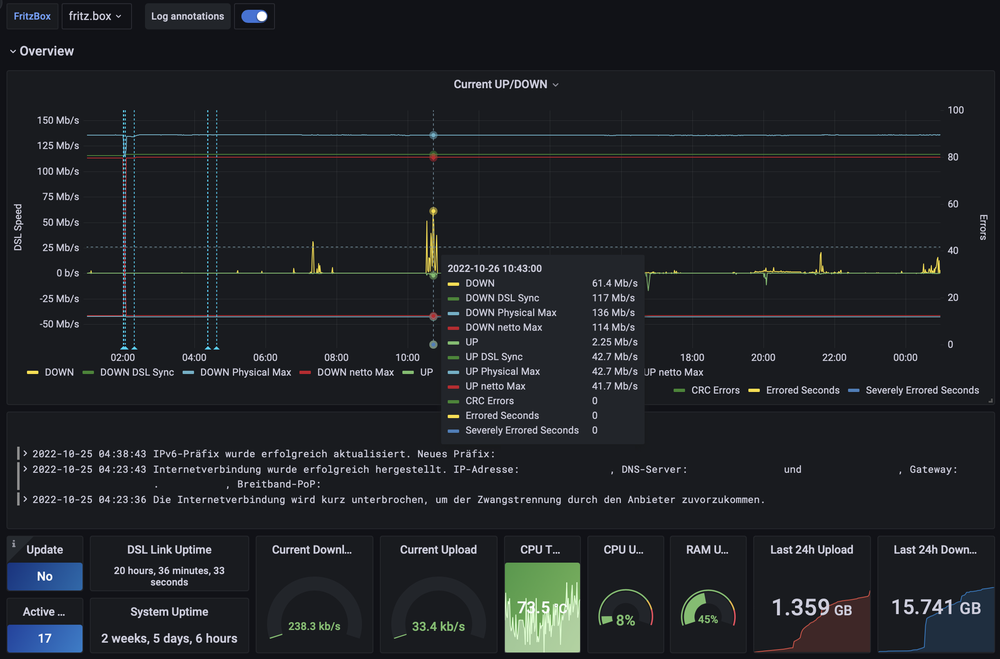

# Fritz InfluxDB

"fritzinfluxdb" is a tool written in python to fetch data from a FritzBox router and writes it to InfluxDB.
It is equal capable as fritzcollectd and directly writing to InfluxDB.

Both influxDB 1 and InfluxDB 2 are supported




## IMPORTANT:
In order work properly you need to enable "permit access for applications" and "state data via UPnP"


## Requirements
* python3.6 or newer
* influxdb (InfluxDB 1)
* influxdb_client (InfluxDB 2)
* fritzconnection
* pytz

### Environment
* Grafana >= 8.4.0

## Setup
* here we assume we install in ```/opt```

ToDo:
* add part with setting up influxdb2 admin env token
* describe setting up grafana to use "Authorization: Token XXX" header

### Configuration

After cloning the repo copy the config from the [example](fritzinfluxdb-sample.ini)
to ```my-fritzinfluxdb.ini``` and edit the settings. All settings are described inside the file.

ToDo: mention of env var reading

### Ubuntu 18.04
ToDo: Update to recent Ubuntu OS
```
sudo apt-get install virtualenv python3-lxml
cd /opt
git clone https://github.com/yunity/fritzinfluxdb.git
cd fritzinfluxdb
virtualenv --system-site-packages -p python3 .venv
. .venv/bin/activate
pip3 install -r requirements.txt
```

### RHEL/CentOS 7 with EPEL
ToDo: Update to recent RHEL OS (rocky)
```
yum install git python36-virtualenv python36-lxml
cd /opt
git clone https://github.com/yunity/fritzinfluxdb.git
cd fritzinfluxdb
virtualenv-3 --system-site-packages .venv
. .venv/bin/activate
pip3 install -r requirements.txt
```

* modify your configuration and test it
```
./fritzinfluxdb.py
```

### Install as systemd service
Ubuntu
```
cp /opt/fritzinfluxdb/fritzinfluxdb.service /etc/systemd/system
```
RHEL/CentOS
```
sed -e 's/nogroup/nobody/g' /opt/fritzinfluxdb/fritzinfluxdb.service > /etc/systemd/system/fritzinfluxdb.service
```

```
systemctl daemon-reload
systemctl start fritzinfluxdb
systemctl enable fritzinfluxdb
```

### Run with Docker
ToDo:
 * provide docker container
 * describe usage of ENV vars
 * update docker-compose file

```
git clone <this_repo_url>
cd fritzinfluxdb
```

Copy the config file and change the settings

Now you should be able to build and run the image with following commands
```
docker build -t fritzinfluxdb .
docker run -d -v /PATH/TO/my-fritzinfluxdb.ini:/app/fritzinfluxdb.ini --name fritzinfluxdb fritzinfluxdb
```

You can alternatively use the provided [docker-compose.yml](docker-compose.yml):
```
docker-compose up -d
```
If you're running the influxdb in a docker on the same host you need to add `--link` to the run command.

### Example:
* starting the influx container
```
docker run --name=influxdb -d -p 8086:8086 influxdb
```
* set influxdb host in `fritzinfluxdb.ini` to `influxdb`
* run docker container
```
docker run --link influxdb -d -v /PATH/TO/my-fritzinfluxdb.ini:/app/fritzinfluxdb.ini --name fritzinfluxdb fritzinfluxdb
```

### Upgrading

* update your virtual env `pip3 install -r requirements.txt`
* use the updated config and add the credentials and addresses from your old config

## Running the script
ToDo: Update to current version
```
usage: fritzinfluxdb.py [-h] [-c fritzinfluxdb.ini [fritzinfluxdb.ini ...]] [-d] [-v]

fritzinfluxdb
Version: 0.4.0 (2020-08-03)
Project URL: https://github.com/karrot-dev/fritzinfluxdb

optional arguments:
  -h, --help            show this help message and exit
  -c fritzinfluxdb.ini [fritzinfluxdb.ini ...], --config fritzinfluxdb.ini [fritzinfluxdb.ini ...]
                        points to the config file to read config data from which is not installed
                        under the default path './fritzinfluxdb.ini'
  -d, --daemon          define if the script is run as a systemd daemon
  -v, --verbose         turn on verbose output to get debug logging
```

## Grafana

There are following Dashboards included:
* [fritzbox_system_dashboard.json](grafana/fritzbox_system_dashboard.json)
* [firtzbox_logs_dashboard.json](grafana/firtzbox_logs_dashboard.json)

*This was heavily inspired from: https://grafana.com/dashboards/713*

# Configure more attributes

check here to find an overview of more attributes which probably could be added
https://wiki.fhem.de/w/index.php?title=FRITZBOX

New services can be defined in [fritzinfluxdb/classes/fritzbox/services_tr069.py](fritzinfluxdb/classes/fritzbox/services_tr069.py)

# License
>You can check out the full license [here](LICENSE.txt)

This project is licensed under the terms of the **MIT** license.
